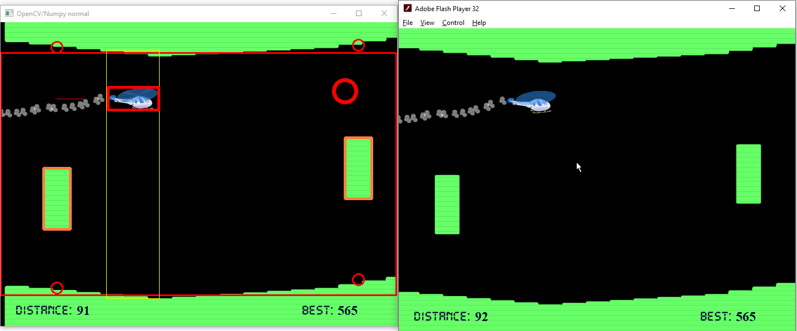

# helicopter_game_cv

A WIP project to automate an old Flash game named Helicopter Game with computer vision.



### How does it work?

It takes a screenshot of the game, does computer vision magic with OpenCV, then clicks your mouse to control the helicopter.

### Requirements

#### OS

Windows 10, since the project uses the Windows API to get the screen coordinates and set the window size and Z-order.

#### Python

Python 3. Also, these requirements, probably:

```
mss==6.1.0
numpy==1.20.3
opencv-python==4.5.3.56
pyautogui==0.9.53
```

### Other

the code is poor

### Running

1. Install the Python deps, you probably know how to do it better than I
2. Download the SWF from the Internet Archive: https://archive.org/details/helicoptergame_flash
3. Download the standalone Flash Player projector from here: https://www.adobe.com/support/flashplayer/debug_downloads.html
    - If the link's dead, use this Internet Archive link: https://web.archive.org/web/20210830200715/https://fpdownload.macromedia.com/pub/flashplayer/updaters/32/flashplayer_32_sa.exe
4. Start the Flash player and File -> Open the SWF
5. Start the program
6. You'll see a new window pop up. **To close the window, activate its window and press `q`**
7. Move your mouse cursor inside the play area of the Flash player. The program will resize the Flash player window and start sending mouse clicks with your mouse with `pyautogui`. The safeties are off from the library, so to stop it, just move your cursor outside of the play area. You should be able to move the Flash player window normally by dragging the window title.
